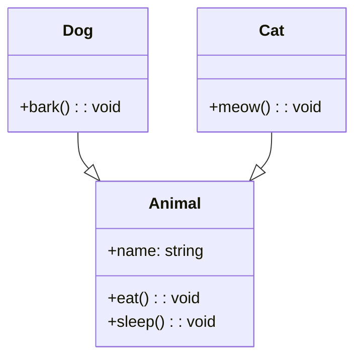

```mermaid
classDiagram
    class Animal {
        +name: string
        +eat(): void
        +sleep(): void
    }

    class Dog {
        +bark(): void
    }

    class Cat {
        +meow(): void
    }

    Dog --|> Animal
    Cat --|> Animal
```
